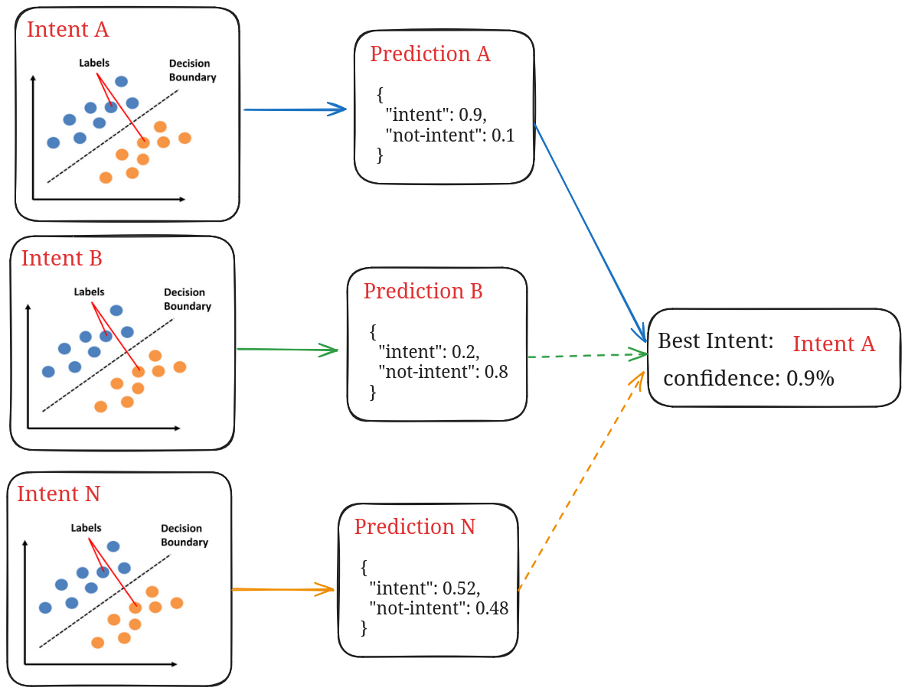

# Linha Fina

A IntentEngine that dynamically accounts for changing reference data at runtime. Add/remove intents dynamically

How it works:

- each intent is an independent SVM that classifies intent vs not-intent
- each intent uses the other intents data as "not-intent" training data
- only most relevant negative samples are used for training (calculated via [token_set_ratio](https://rapidfuzz.github.io/RapidFuzz/Usage/fuzz.html#token-set-ratio))
- features are just [one-hot-encoded](https://en.wikipedia.org/wiki/One-hot) keyword vectors
- entity extraction from templates via [simplematch](https://github.com/tfeldmann/simplematch)
- entity extraction based on wordlists, optionally via [aho-corasick](https://en.wikipedia.org/wiki/Aho%E2%80%93Corasick_algorithm)


Limitations:
- long warm up time (training happens on first inference)
- doesn't scale well to a large number of intents
- does not take word position into account
- needs retraining whenever a new intent is added



## Usage

```python
from linha_fina.engine import IntentEngine

engine = IntentEngine()

intent_1 = ["hello world", "hey there", "hello"]
intent_2 = ["tell me a joke", "say a joke", "make me laugh"]
intent_3 = ["how is the weather", "what's the weather like",
            "what is the weather outside"]
intent_4 = ["my name is {name}", "call me {name}"]
intent_5 = ["change the color to {color}",
            "change light to {color}",
            "set light to {color}}"]

engine.register_intent("hello", intent_1)
engine.register_intent("joke", intent_2)
engine.register_intent("weather", intent_3)
engine.register_intent("introduce", intent_4)
engine.register_intent("change_color", intent_5, entity_samples={"color": ["red", "blue"]})
# you can register more entity examples after intent creation
engine.register_entity("color", ["yellow", "green"], intent_name="color")

for s in ["hello earth",
          "call me Casimiro",
          "my name is Miro",
          "tell me a joke",
          "what is the weather",
          "tell me a joke about the weather",
          "red blue and green are my 3 favorite colors",
          "red is my favorite color",
          "light to blue",
          "change to green",
          "make color green"
          ]:
    print(s)
    print(engine.calc_intent(s))
    # hello earth
    # IntentMatch(name='hello', slots={}, conf=0.9728585833827678)
    # call me Casimiro
    # IntentMatch(name='introduce', slots=[{'name': 'Casimiro'}], conf=0.9236423200801248)
    # my name is Miro
    # IntentMatch(name='introduce', slots=[{'name': 'Miro'}], conf=0.9949282563482034)
    # tell me a joke
    # IntentMatch(name='joke', slots={}, conf=0.9728801357230902)
    # what is the weather
    # IntentMatch(name='weather', slots={}, conf=0.9427588770219081)
    # tell me a joke about the weather
    # IntentMatch(name='joke', slots={}, conf=0.9728801357230902)
    # red blue and green are my 3 favorite colors
    # IntentMatch(name='change_color', slots={'color': 'green'}, conf=0.9648410361539215)
    # red is my favorite color
    # IntentMatch(name='change_color', slots={'color': 'red'}, conf=0.9142220645436988)
    # light to blue
    # IntentMatch(name='change_color', slots={'color': 'blue'}, conf=0.9845866111672085)
    # change to green
    # IntentMatch(name='change_color', slots={'color': 'green'}, conf=0.9598265049335444)
    # make color green
    # IntentMatch(name='change_color', slots={'color': 'green'}, conf=0.9142364945872282)
```